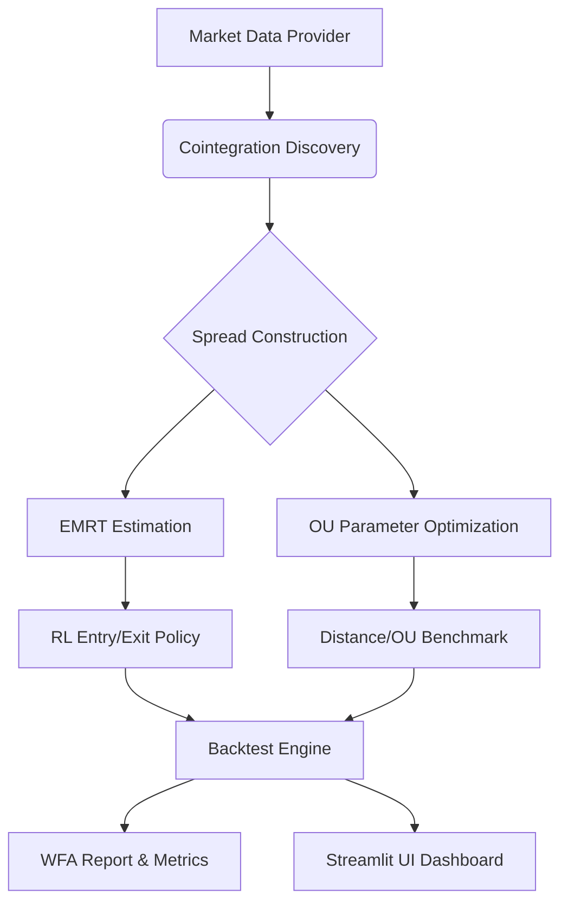

# Advanced Statistical Arbitrage with EMRT & Reinforcement Learning

[](https://opensource.org/licenses/MIT)
[](https://www.python.org/downloads/)

This research repository implements a statistical arbitrage framework combining **Empirical Mean Reversion Time (EMRT)** theory with **Tabular Reinforcement Learning**. The system handles the lifecycle of pair trading: from cointegration discovery (including Johansen tests) to spread construction and execution using a Q-learning agent. It includes benchmarks against traditional Distance and Ornstein-Uhlenbeck (OU) methods.

## System Architecture



## Core Features

- **Multi-Stage Discovery**: Johansen tests and Engle-Granger tests for pair and group cointegration.
- **EMRT Optimizer**: Dynamic coefficient selection to minimize mean reversion time.
- **RL Execution**: Tabular Q-learning agent trained on spread states.
- **Comprehensive Backtesting**: Support for Walk-Forward Analysis (WFA) and transaction cost modeling.
- **GPU Acceleration**: CUDA-accelerated cointegration scanning (via CuPy).
- **Interactive UI**: Streamlit dashboard for real-time visualization of spreads and agent behavior.

## Quick Start

### Installation

```bash
git clone https://github.com/AmeerJ97/stat-arb-emrt-rl.git
cd stat-arb-emrt-rl
python -m venv .venv
source .venv/bin/activate
pip install -e ".[dev,ui]"
```

### Usage Examples

```bash
# Run discovery and backtest
emrt-rl backtest --pair MSFT:GOOGL

# Launch the Streamlit dashboard
emrt-rl streamlit

# Execute Walk-Forward Analysis
emrt-rl wfa
```

## References

- Ning, B., & Lee, K. (2024). *Advanced Statistical Arbitrage with Reinforcement Learning*. arXiv preprint [arXiv:2403.12180](https://arxiv.org/abs/2403.12180).
